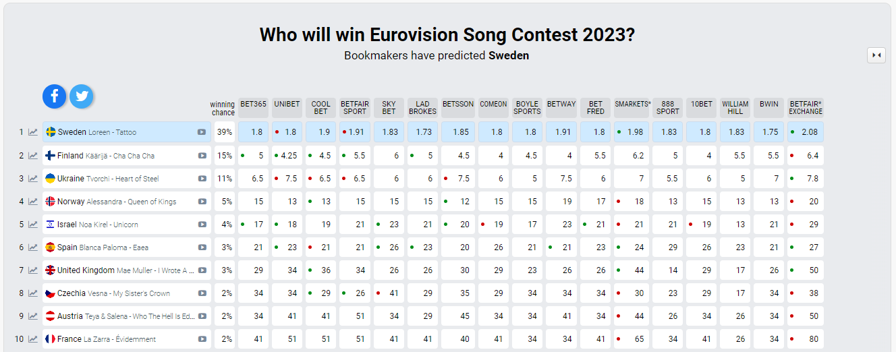

# Eurovision 2023 Odds - Web Scraping

Este mini-proyecto consiste en la recopilación de datos de probabilidad de victoria en el Festival de Eurovisión 2023, que se celebrará en Reino Unido el sábado 13 de mayo.

## Acceso a los datos

Para facilitar la redacción de los datos, creamos esta hoja de cálculos en Google Sheets [en este enlace](https://docs.google.com/spreadsheets/d/100tpJirFmftKnFV5f1Cclr61CBZkU2d380OqO6r8DeM/edit?usp=sharing)

## Funcionamiento

Con la ejecución del archivo escrito en python 'scraping.py', obtendremos diariamente, mediante _web scraping_, los datos de probabilidad de victoria de todas las canciones y artistas participantes, en distintas casas de apuestas.

Los datos, como comentamos, se obtendrán mediante la técnica de _web scraping_, accediendo a la siguiente URL y recogiendo los datos de la tabla que aparece en ella: https://eurovisionworld.com/odds/eurovision

A día 21 de marzo del 2023, las casas de apuestas que aparecen en esta tabla son las siguientes:

- BET365
- UNIBET
- COOL BET
- BETFAIR SPORT
- SKY BET
- BETSSON 
- LAD BROKES
- COMEON
- SMARKETS
- 888 SPORT
- BOYLE SPORTS
- BET FRED
- 10BET
- BETWAY
- WILLIAM HILL
- BETFAIR EXCHANGE
- BWIN